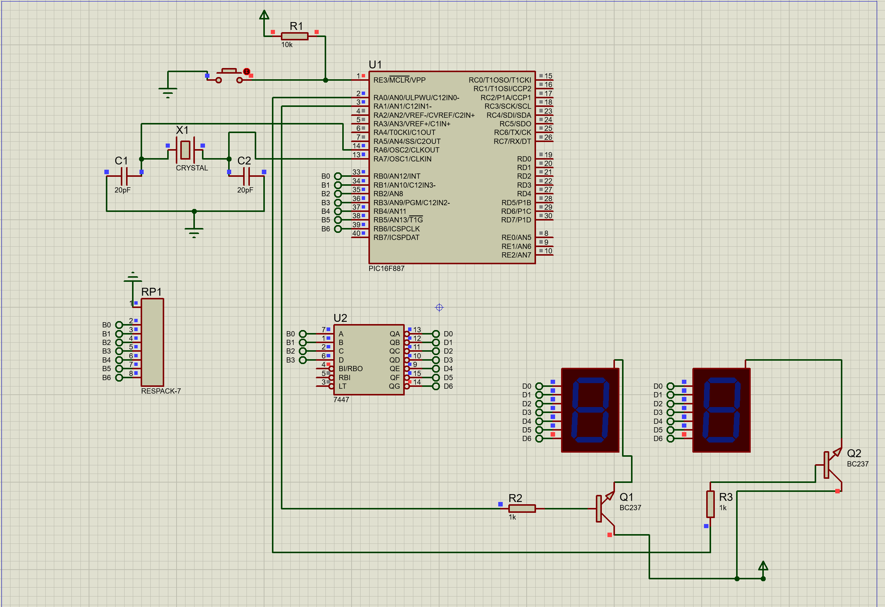

# Two 7-Segment Displays Multiplexing with 7447 Decoder

## Description
This project demonstrates how to control two 7-segment displays using multiplexing and a 7447 BCD-to-7-segment decoder IC. The program increments a counter from 0 to 99 and displays the count on the two 7-segment displays, with one display showing the units place and the other showing the tens place.

## Circuit
### 7-Segment Displays and 7447 Decoder Setup
  
*Circuit setup for interfacing the 7-segment displays and 7447 decoder with the microcontroller.*

## Code Explanation
The program uses multiplexing to alternately display the units and tens digits on the two 7-segment displays. The 7447 decoder IC converts the BCD output from the microcontroller into the appropriate signals for the 7-segment displays.

### Multiplexing Logic
- **PORTB:** Connected to the 7447 decoder inputs (BCD codes for the digits).
- **PORTA:** Used for multiplexing control (PORTA0 for units display, PORTA1 for tens display).
- The microcontroller alternates between enabling the units and tens displays, sending the corresponding BCD codes to the 7447 decoder.

### Counter Logic
- The counter increments from 0 to 99.
- The `units` digit is calculated using `count % 10`.
- The `tens` digit is calculated using `count / 10`.
- The counter resets to 0 after reaching 99.

## Files
- `two_7-seg_multiplexes_&_decodeur_7447.pdsprj`: Circuit schematic for the two 7-segment displays and 7447 decoder.
- `tp3_two_7-seg_multiplexes_&_decodeur_7447.c`: MikroC program for controlling the displays with multiplexing and the 7447 decoder.

## Instructions
1. Open `two_7seg_multiplex_7447.pdsprj` in Proteus to view the circuit design.
2. Compile `tp3_two_7-seg_multiplexes_&_decodeur_7447.c` in MikroC to generate the hex file.
3. Upload the hex file to the microcontroller in Proteus.
4. Simulate the circuit and observe the counter incrementing on the two 7-segment displays.

## Tools
- MikroC Pro for PIC
- Proteus 8 Professional
